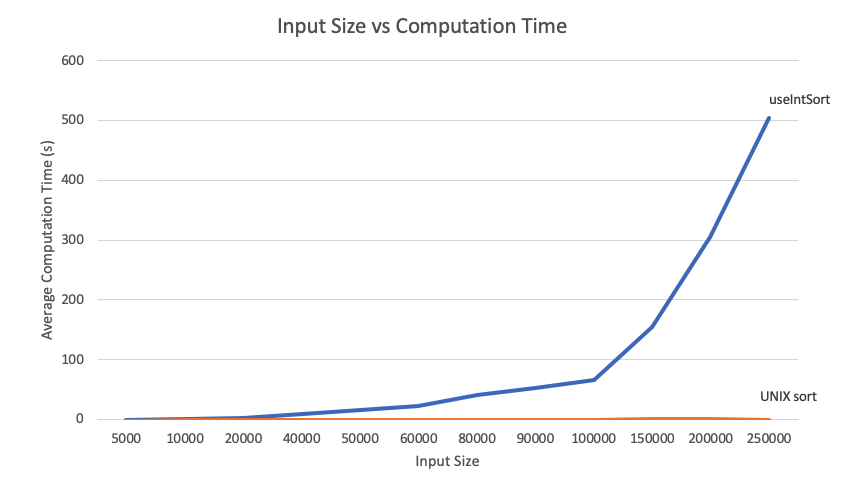

# Computation Time Comparison Between useIntSort and UNIX sort Algorithms
[Link to repository](https://github.com/axieax/sort-algorithm-time)

## The Task
The task involves completing the program [useIntList.c](useIntList.c), which reads and sorts a list of integers in increasing order using linked lists and insertion sort. We are then required to compare the average computation time of useIntList to the UNIX sort command.
My useIntSort program first checks whether it is possible to insert a number at the start of an ordered list (i.e. it is the smallest number), and similarly for the end (i.e. it is the biggest number), before a general insertion mechanic which places it in the appropriate increasing order position. More information about the task can be found [here](https://cgi.cse.unsw.edu.au/~cs2521/20T2/labs/week01/index.php). 

## Hypothesis
useIntSort uses an insertion sort algorithm, which is not very efficient compared to several other sorting algorithms. As a built-in UNIX command, it can be assumed that UNIX sort would be way more efficient. For useIntSort, initially reversed and sorted inputs should be significantly faster than initially random inputs since the computer does not have to traverse the linked list as far each time, just updating the front and end of the linked list respectively. These could potentially be calculated in linear instead of quadratic time. Furthermore for useIntSort, initially reversed inputs should be computed faster as the front of the list is checked first, and thus, less computing is necessary compared to the other tests. 

## Data Processing
1. Run the shell [experiment.sh](experiment.sh) and save its output to [raw_data.txt](raw_data.txt) by running `sh experiment.sh |& tee raw_data.txt`. The shell script generates a list of numbers according to the task's specification, where for a varying number of input size, a sequence of initially random, sorted and reversed numbers (with and without duplicates) are generated, using [randList](randList) for possible duplicate numbers and `seq` for non-duplicate numbers. Although these files are generated into the directory `data/`, the shell script can be modified so that these files are generated into `/tmp/` instead, although there were large variances in computation time between trials doing so. After generating these files, the shell displays the timing data (excluding the sorted output of the input numbers), which can be saved into [raw_data.txt](raw_data.txt) using the specified command.
1. Now we need to extract useful data out of [raw_data.txt](raw_data.txt), i.e. the input size, test type and "user" time for each trial (which refers to the time spent executing the code of the command). The Python program [extract.py](extract.py) filters the [raw_data.txt](raw_data.txt) file for these specified lines into a file called [extracted.txt](extract.txt).
1. Now we need to clean up the data in [extracted.txt](extract.txt), as the trial times are in the format "user	XmX.XXXs". The Python program [clean.py](clean.py) processes the time (excluding the "user" subtring) for relevant lines into a single time in seconds, before saving this to [results.txt](results.txt).
1. Now we can process this file in Microsoft Excel, transforming the contents of [results.txt](results.txt) into the specified table format. Here, we can calculate the average time and create graphs demonstrating the results. We can also create a Tab-delimited Text file as per task specifications. In [sort_results.xlsx](sort_results.xlsx), simply paste the contents of [results.txt](results.txt) into the yellow cell in the "Extract" workbook as specified, and the entire table and data analysis will be generated.

## The Results

As expected, the UNIX sort algorithm sorted the number inputs significantly faster than the useIntList program. The general insertion sort algorithm has a computational complexity of 𝒪(𝑛2) with 𝑛 representing the input size, as each number to be inserted is compared to the other n values in order to determine where it should be inserted, which is very inefficient. This can be seen by the curve below which fits a quadratic model.

useIntSort Model           |  UNIX sort Model
:-------------------------:|:-------------------------:
  |  

On the other hand, the UNIX sort algorithm uses an [External R-Way Merge Sort](http://vkundeti.blogspot.com/2008/03/tech-algorithmic-details-of-unix-sort.html) with a computational complexity of 𝒪((N/M)log(N/M)/log(R)). Analysing the graph below, I initially tried a  linear proportional model, which seemed to fit the curve pretty well. However, investigating the computational complexity of a regular merge sort algorithm, which is 𝒪(𝑛log𝑛) using divide-and-conquer techniques, I obtained a better model with  nlog(n) (having a lower RMSE value). It is difficult to determine the algorithm model based on the current dataset due to the small values of time obtained for the input sizes of 5000 to 250000. Further trials are necessary for a better model, especially with larger input sizes for larger values of time. 

### Further Observations:
In general, initially random inputs took significantly longer to compute compared to initially sorted and reversed inputs, which were computed in similar times with initially sorted lists slightly faster. Whether the list had duplicates or not did not seem to affect the computation time. 

useIntSort Initial Conditions Comparison |  UNIX sort Initial Conditions Comparison
:-------------------------:|:-------------------------:
  |  

*Please note: more graphs can be found in [sort_results.xlsx](sort_results.xlsx) in the "Analysis" worksheet.*

## Discussion
As explained above, insertion sort is a rather inefficient method of sorting. UNIX sort, using a merge sort algorithm, triumphs useIntSort in computation time due to the algorithmic efficiency of divide-and-conquer (a thorough explanation can be found in my [Fourier Transforms Project Report](https://github.com/axieax/fourier/)). 

### useIntSort
As expected, useIntSort dealt with sorted and reversed inputs significantly faster than random inputs. This is because the program needs to only update the start or end of the linked list instead of traversing through the entire list and finding the appropriate position to insert each number. It was surprising to see that reversed inputs were actually slightly slower than sorted ones, as there should be less computing required so they should be faster. Although I anticipated a somewhat linear time for sorted and reversed inputs, graph analysis suggests that an 𝒪(𝑛2) model was a better fit. I thought that if the inputs were initially reversed, there would only need to be a single comparison to the start of the list (and an extra one for the end of the list for sorted inputs), resulting in an 𝒪(𝑛) complexity.

### UNIX sort
With the merge sort algorithm, sorted and reversed inputs would be faster than initially random inputs as each subdivision would be sorted faster, requiring less sorting each time. Initially sorted inputs would be faster than the reversed inputs since the lowest-level subdivisions are already sorted, unlike the reversed ones which would have to be sorted at each level, although less sorting is required than for initially random inputs.

## Final Comments
There are many ways of improving this project, especially in the extraction and cleaning of data. However, I initially designed the raw time data output with user readibility in mind, where lines could have been omitted for better manipulation of data. It is possible to condense the several steps into a single one, using Python to generate the specified tab-delineated format directly. Also, several adjustments in hopes of improving the efficiency of useIntList were made, resulting in quite some time wasted on wasted computations. 
